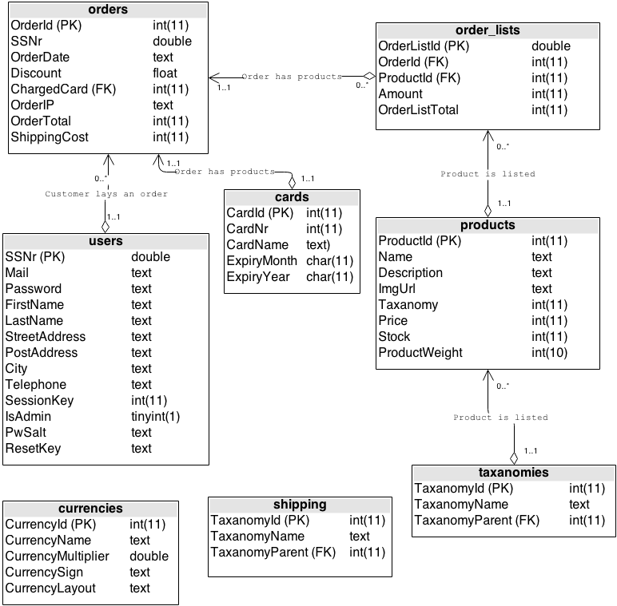

## 1. Metod

Projektet har utvecklats med verktygen Git och GitHub för att hålla ordning på allt som behöver göras och vad som ska bli gjort med hjälp av GitHubs issue-tracking.

Till en början togs ER-modeller och skisser på vilka funktioner och funktionalitet som den färdiga webbshoppen skulle inehålla. Utifrån det börjades det sedan paralellt utvecklas en databas-modul och en router-modul som senare i projektet byggdes ihop. Utifrån vad som behövdes för att få till ut presentation utvecklades fram funktioner i `functions.php`.

Kvalitétskontrollering har gjorts genom att kontinuerligt granska varandras kod och komma med kritik och kommentarer. Detta har skötts till stor del via Issues i GitHub men även via chatt och konversationer.
Det mesta av utvecklandet har skett individuellt och ej i grupp och gruppen har till största del arbetat utifrån Git.

## 2. Resultat

Gruppen har fått fram en webbshopp som enligt vår tolkning uppfyller alla de krav som har lagts fram i kravspecifikationen. Och en hel del andra funktioner som ej stod med.

En live-variant av webbshoppen finns på [http://hockeygear.lindqvist.io](http://hockeygear.lindqvist.io) inloggning för test-konto är `lindqvist.gustav@gmail.com` med lösenord `test`.

Fullständig historik och resultat finns på [http://github.com/reedyn/Just-Another-Webshop](http://github.com/reedyn/Just-Another-Webshop)

Projektet är uppdelat i två större grupper, presentation och data-hantering.

Upplägget är tänkt att göra det enkelt att utveckla mer funktionalitet senare, som ett komplett system för teman (en tanke var att göra själva presentationen i `page-*.php` filerna liknande så som WordPress gör med sin ***"the loop"*** vid en sådan utveckling senare).

På grund av detta är koden i ett flertal filer separerade, som till exempel databas-inloggning lever i `config.php` istället för att skriva in direkt vid skapandet av *Database-objektet*.

```
index.php
.htaccess
/core/
	This folder contains the files that include the real programming, the router in init.php, database in db.php, functions in functions.php 
/content/
	All template-files that include validation and presentation are here.
	/img/
    	Folder for uploaded product images
    /themes/
    	Folder for themes, We only have one theme right now.
    	/default/
        	/css/
            /js/
            /fonts/
            /img/
```

Systemet sitter ihop på följande sätt:


Databasen är uppbyggd på följande sätt:


### Resultat enligt kravspec

#### Betyg 4

##### Struktur för produkter (Taxonomies)

##### Transaktioner i databasen

##### Klasser

##### Sortering och filtrering

#### Betyg 5

##### Captcha

##### Bildhantering

##### Registrering och kontohantering

##### Databasklass

##### Administrationshantering

##### Valutor

 * [x] Användare ska kunna ändra sin information när dom är inloggade. Nya lösenord skall kunna
sättas, förutsatt att man matar in det gamla lösenordet.
 * [x] Databaskopplingen skall göras genom att använda en databasklass. Databasklassen skall ärva
klassen ”Mysqli” och lämpliga funktioner för databashantering skall finnas, t.ex. SaveUser(),
saveProduct(), getUserByID() osv.
 * [x] Administratören skall kunna annullera en order. Serien av ordrar får aldrig brytas, det måste
finnas en konsekvent serie av ordernummer.
 * [x] Webshoppen skall ha stöd för flera valutor. Använd EURO som bas. En växlingskurs som kan
redigeras av administratören räknar sedan om priset för SEK, NOK och USD.
 * [x] Administratören skall kunna ta fram och presentera på lämpligt sätt uppgifter på
försäljningsstatistik (antal gjorda ordrar, summa belopp för dessa ordrar, medelvärde, minsta
resp. största orderbelopp) under en viss tidsperiod för de olika produkterna i en viss
produktkategori. Dessa uppgifter tas fram från databasen med lämpliga SQL‐frågor.

### 2.1 Individuella resultat
Gruppen har haft tydliga områden som var och en varit ansvarig för men har kodat lite på varandras under tiden, så det är inte 100% en person som gjort varje enskild modul.

#### 2.1.1 Gustav

Gustav har till största delen skött planering och organisation av projektet. Och all dokumentation och skötseln av repositoryn på GitHub och utformning av workflows och liknande.

Eftersom Gustav gjort mycket av planering hade han bra koll på vad som behövde göras och skrev mycket pseudo-kod och skal för kommande funktioner (Output/Input för specifika funktioner)

**Gustav har utvecklat följande:**

 * `.htaccess` med RegularExpressions  och `router()` funktionaliteten.
 * All validering med RegularExpressions (Använt HTML5 validering med JavaScript fallback).
 * Innehållssidor (`page-*.php`) samt `header.php` och `footer.php`.
 * Drygt hälften av `functions.php` *(Främst de funktioner som berör presentation som includeHeader() eller isAdmin()*.
 * Bas-strukturen för User, Product och Order klasser.

#### 2.1.2. Marcus

Marcus har varit den som programmerat och utformat grunden i hela applikationen. Ser man till rader kod *PHP* är det Marcus som programmerat mest.

**Marcus har utvecklat följande:**

 * `config.php`, `db.php` samt skapandet av SQL-databasen utifrån den struktur som togs fram gemensamt.
 * Drygt hälften av `functions.php` *(Alla de funktioner som skriver ut, samt flertalet Add/Delete/Edit-funktioner)*.
 * Förändringar i de klasser Gustav skapat och klasser för de objekt som kom till senare i projektet.

#### 2.1.3. David

David har tagit fram design och struktur för Front-End i HTML, CSS och JavaScript.

### 2.2. Avgränsningar

Mycket funktionalitet som var påtänkt från början har lagts på hyllan för att göra det möjligt att få färdigt projektet i tid. Bland annat:

 * Funktionalitet att dynamiskt ändra teman.
 * Bygga presentationen av data på ett sådant sätt att man enkelt kan använda samma metod för att skriva ut flera olika typer av data. Som det är nu finns en funktion för varje specifik typ av data till exempel `listAdminProduct()`. En tanke var att göra liknande WordPress med en generell *loop* som skriver ut det som en viss sida är til för. Tanken var även att göra `router()` funktionen på samma sätt så att den utifrån en viss struktur som `page-*.php` sidorna var uppbyggda på, skicka användaren till rätt sida istället för den mer statiska variant som används nu.

## 3 Summering && Reflektion

Projektet i sin helhet har gått bra. Ribban sattes något högt initialt vilket gjorde att vi ej klarade första deadline. Samma ribba behölls dock och det blev färdigt med den funktionalitet som gruppen ville ha inbyggd till deadline för komplettering.

Till nästa gång ska det tänkas på att även om man har en hög ribba, se till att få färdigt den funktionalitet som krävs för lägsta betygen och sen arbeta sig uppåt, för att undvika stress över att inte bli färdiga.

Projektet började även i fel ändå, Front-End skulle gjorts i ett tidigt skede för att enkelt kunna se vad som behöver göras. När man börjar utveckla med databasen blir det ett väldigt abstrakt projekt.